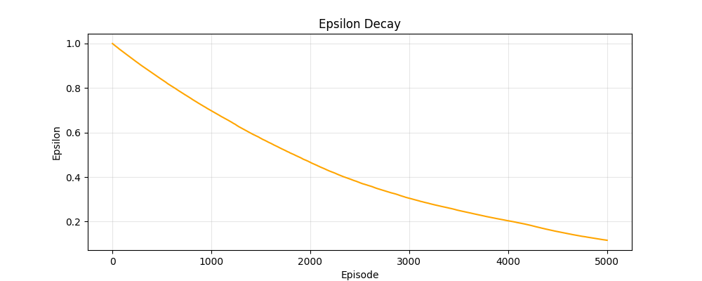
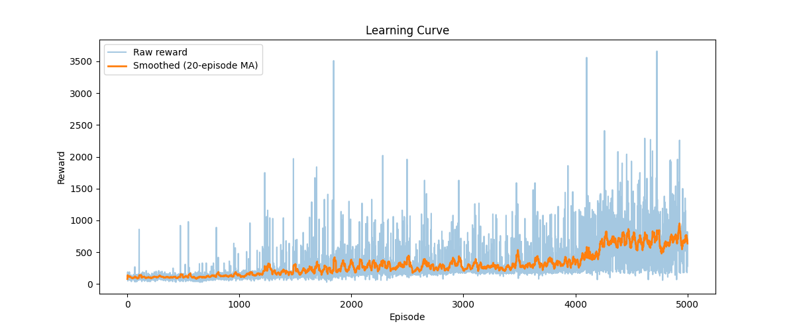
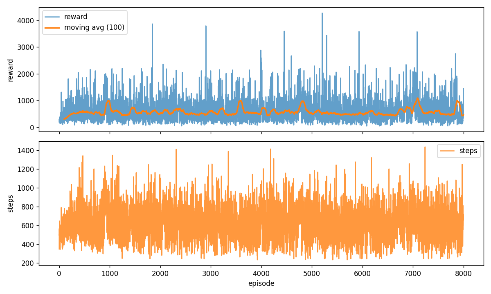
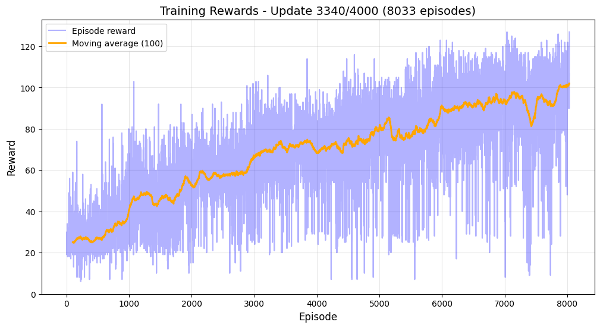
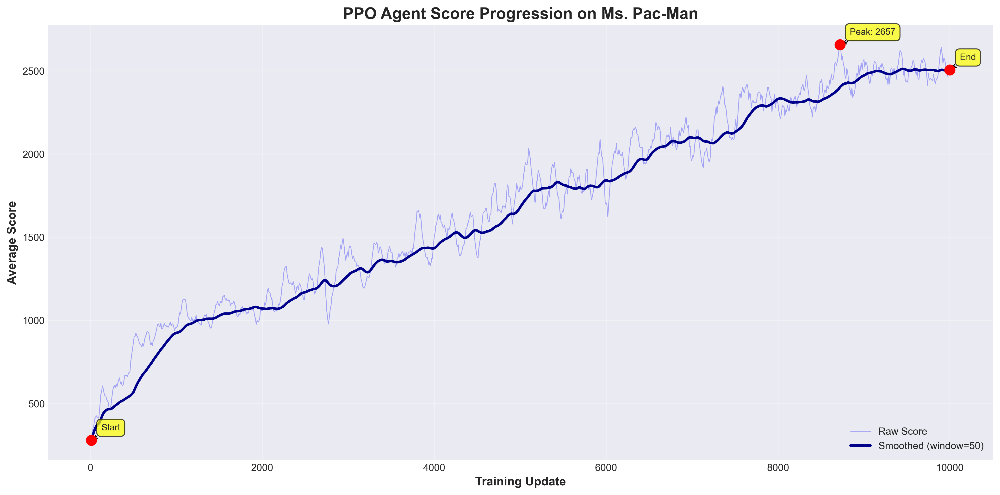

# Agent Plays Ms. Pac-Man

ECS 170 – Group 9

## Why Ms. Pac-Man?

We chose **Ms. Pac-Man** because it provides a more challenging and dynamic environment for reinforcement learning compared to the original Pac-Man. Unlike Pac-Man’s single maze and predictable ghost paths, Ms. Pac-Man features:

- Four unique mazes
- Randomized fruit spawns
- Less predictable ghost movement patterns

This unpredictability forces agents to generalize, adapt, and balance survival with reward acquisition — making it a significantly more interesting environment for RL research.

## Environment

We use the **Atari Learning Environment (ALE)** and **Gymnasium** to create a consistent, flexible environment for training and evaluating agents.

Gymnasium/ALE provide:

- A standard RL API (`reset`, `step`)
- Access to screen frames
- Access to raw RAM state
- Frame skipping (4)
- Frame stacking (4)
- Sticky actions (25%)
- Reward clipping (-1, 0, +1)

These preprocessing steps ensure stability, reduce redundancy, help agents understand movement, and improve training efficiency.


## Prerequisites

- Python **3.8 or later**
- pip

## Create and activate a virtual environment (Linux / macOS)

1. Create the virtual environment:

```
python3 -m venv .venv
```

2. Activate it:

```
source .venv/bin/activate
```

On Windows (PowerShell):

```
python -m venv .venv
.\.venv\Scripts\Activate.ps1
```

## Install dependencies with pip

```
pip install --upgrade pip setuptools wheel
pip install -r requirements.txt
```


## Deactivate the virtual environment

```
deactivate
```

## If requirements.txt is missing

Create it from an active virtual environment:

```
pip freeze > requirements.txt
```

## Project Structure


```
.
├── main.py                     # Shared training & evaluation utilities
├── requirements.txt
├── train_ppo.py                # PPO training script
├── train_dql.py                # DQN / Deep Q training script
├── train_ql.py                 # Q-Learning training script
├── test.py                     # Simple environment or baseline test script
├── play_5_ppo.sh               # Run PPO agent for 5 evaluation episodes
│
├── agents/
│   ├── base.py                 # Abstract base class defining agent API
│   ├── random_agent.py         # Random policy agent
│   ├── ql_agent.py             # Tabular Q-Learning agent
│   ├── deep_ql_agent.py        # Deep Q-Network (DQN) agent
│   ├── ppo_agent.py            # PPO actor-critic agent
│   └── duel-qn-agent.py        # Prototype Dueling DQN agent (experimental)
│
├── config/
│   ├── base.py
│   ├── random_config.py
│   ├── ql_config.py
│   ├── dql_config.py
│   └── ppo_config.py
│
├── models/
│   ├── qlearning/
│   │   └── agent_latest.pkl
│   └── ppo/
│       └── agent_latest.pt
│
├── results/
│   ├── dql/
│   │   ├── learning_curve.png
│   │   ├── epsilon_decay.png
│   ├── qlearning/
│   │   ├── rewards.png
│   │   └── episode_log.csv
│   └── ppo/
│       └── score_progression.png
│       └── rewards_latest.png
│
├── reports/
│   └── project_check_in/
│       ├── project_check_in.md
│       ├── ppo_rewards_latest.png
│       └── group_members.yaml
│
└── README.md
```

## Functions in `main.py`

### `train(agent_class, config, render_human=False)`

* **agent_class**: The agent class to instantiate (not an instance)
* **config**: Configuration object specifying hyperparameters and environment settings
* **render_human**: If `True`, visualizes training (much slower)
* **Returns**: Path to the saved model checkpoint created during training

### `play(agent_class, config, model_path, num_episodes=5)`

* **agent_class**: Agent class to load and run
* **config**: Configuration object
* **model_path**: Path to a saved `.pkl` or `.pt` model (empty string loads an untrained model)
* **num_episodes**: Number of episodes to run for evaluation or human-visible gameplay


## Implemented Agents

All agents inherit from a unified interface (`agents/base.py`).

### Random Agent

Ensures preprocessing, rendering, and episode logic work.

### Q-Learning Agent

- Tabular Q-learning using RAM features — learns simple behaviors but quickly plateaus.

### Deep Q-Learning (DQN)

- Neural network approximator, experience replay, target network. Learns meaningful behaviors but is noisy and unstable.

### PPO Agent

- Actor–critic architecture with clipped updates. Demonstrated the strongest and most stable performance in our experiments.

### Dueling DQN (Prototype)

- Splits Q-values into Value + Advantage streams. Not fully implemented but included for completeness.


## Training & Evaluation

### Train PPO

```
python train_ppo.py
```

### Train DQN / Deep Q-Learning

```
python train_dql.py
```

### Test baseline or environment

```
python test.py
```

### Watch PPO agent play 5 episodes

```
bash play_5_ppo.sh
```

# Results

Our experiments evaluated three main learning-based agents: **Q-Learning**, **Deep Q-Learning (DQN)**, and **PPO**. 

## Deep Q-Learning

### **Epsilon Decay Schedule**
The DQN agent starts fully exploratory (ε = 1.0) and smoothly decays to ~0.1, encouraging more stable exploitation later in training.



---

### **Learning Curve**
The DQN agent demonstrates meaningful but unstable learning behavior.
- Raw episode rewards fluctuate heavily, typical for Ms. Pac-Man.
- The 20-episode moving average shows a gradual upward trend as the agent learns reactive ghost avoidance and pellet clearing.




## Q-Learning

Q-Learning over Atari RAM learns simple short-term strategies but plateaus early because the RAM space is large and noisy.



The `episode_log.csv` contains reward and timestep data for every episode.

## PPO

PPO was the **strongest-performing algorithm** across all experiments, showing gradual and reliable improvement due to:
- clipped objective function,
- stable actor–critic optimization,
- reward clipping,
- and frame preprocessing.

### **PPO Moving-Average Reward Progression**
This plot shows PPO’s stability: despite high per-episode variance, the smoothed moving average grows steadily across ~8,000 episodes.



### **PPO Score Progression**

- Sharp upward trend over **10,000 training updates**
- Early performance near **300–400 points**
- Peak score near **2657**
- Final stabilized performance around **2300–2400**




### Why PPO Works Better

* Clipped objective prevents destructive updates.
* Actor-critic structure stabilizes learning.
* Reward clipping avoids large gradient explosions.

### Behavioral Improvements

* Safer navigation through the maze
* More consistent ghost avoidance
* Better exploitation of scoring opportunities (dense pellets, fruits)

Overall PPO shows **the most reliable and meaningful learning** of all implemented agents.


# Future Improvements

* Improved CNN architectures for PPO
* Complete Dueling DQN
* Reward scaling (log rewards)
* Vectorized environments to train multiple games in parallel
* UI/dashboard for visualizing agent play
* More robust error handling

## Contributors

*  Ann Le
*  Grace Zhang
*  Haylie Tan
*  Ian Wong
*  Joanne Lai
*  Keren Skariah
*  Sandeep Reehal
*  Sathvik Parasa
*  Shreyans Porwal